# 🩺 End-to-End MLOps: Diabetes Progression Prediction


> A production-ready, full-stack MLOps system demonstrating the complete machine learning lifecycle from data ingestion to cloud deployment.

---

## 🚀 Live Demo

Experience the application in action:

| Service | URL | Description |
|---------|-----|-------------|
| 🖥️ **Frontend** | [Streamlit App](https://diabetes-frontend-9oya.onrender.com) | Interactive prediction interface |
| 📡 **API** | [Swagger Docs](https://diabetes-api-lpra.onrender.com/docs) | RESTful API documentation |
| 🤗 **Gradio (HF Space)** | [Gradio UI](https://huggingface.co/spaces/Mesutssmn/diatebes-mlops) | Always-on public ML demo (local inference) |
> **Note:** Update the API link with your actual Render deployment URL

### Deployment Strategy
- **FastAPI + Streamlit (Render):** Production-style deployment
- **Gradio (Hugging Face Spaces):** Public, always-available demo with local model inference  
  *(No external API dependency — avoids cold-start issues)*

---

## 📋 Table of Contents

- [Overview](#-overview)
- [Key Features](#-key-features)
- [System Architecture](#️-system-architecture)
- [Tech Stack](#-tech-stack)
- [Getting Started](#-getting-started)
- [Usage](#-usage)
- [Model Performance](#-model-performance)
- [Project Structure](#-project-structure)
- [Contributing](#-contributing)
- [License](#-license)

---

## 🎯 Overview

This project showcases a **production-grade MLOps pipeline** for predicting diabetes disease progression.  
It follows industry best practices across the full ML lifecycle: training, evaluation, versioning, serving, monitoring, and deployment.

### What Makes This Project Stand Out?

- **AutoML Pipeline** comparing multiple models (ElasticNet, Random Forest, XGBoost)
- **Champion Model Selection** using cross-validated R² score
- **Hybrid Deployment Strategy**
  - MLflow Registry for development
  - Local model artifacts for production reliability
- **Dual Inference Surfaces**
  - API-based inference (FastAPI)
  - UI-based inference (Streamlit & Gradio)

---

## ✨ Key Features

### 🤖 Machine Learning
- Automated training and evaluation pipeline
- MLflow-based experiment tracking and model registry
- Deterministic feature ordering and preprocessing
- Reproducible training via Docker

### 🏗️ Architecture
- API-first design with FastAPI
- Stateless inference layer
- Separate UI clients (Streamlit & Gradio)
- Clear separation of training, serving, and presentation layers

### 🔄 DevOps & CI/CD
- Dockerized services
- GitHub Actions for CI
- Config-driven pipelines
- Cloud-ready deployments

---

## 🏗️ System Architecture

```mermaid
graph TB
    subgraph "User Layer"
        User[👤 User]
    end
    
    subgraph "Frontend Layer"
        UI[🎨 Streamlit UI<br/>Port: 8501]
    end
    
    subgraph "Backend Layer"
        API[⚡ FastAPI Server<br/>Port: 8000]
    end
    
    subgraph "ML Layer"
        MLflow[📊 MLflow Server<br/>Port: 5000]
        Model[🤖 XGBoost Model]
        LocalArtifact[📦 Local Model Artifact]
    end
    
    subgraph "Data Layer"
        DB[(🗄️ SQLite DB)]
    end
    
    User -->|HTTP Request| UI
    UI -->|REST API| API
    API -->|Dev Mode| MLflow
    API -->|Production Mode| LocalArtifact
    MLflow --> Model
    MLflow --> DB
    
    style User fill:#e1f5ff
    style UI fill:#fff3cd
    style API fill:#d4edda
    style MLflow fill:#f8d7da
    style Model fill:#d1ecf1
```



### Architecture Highlights

- **Development Mode**: Models loaded from MLflow Registry for experimentation
- **Production Mode**: Automatic fallback to local artifacts for reliability
- **Stateless API**: Enables horizontal scaling and load balancing
- **Persistent Storage**: Experiment tracking and model versioning in SQLite

---

## 🛠️ Tech Stack

| Component | Technology | Purpose |
|-----------|-----------|---------|
| **Language** |  | Core programming language |
| **Web Framework** |  | High-performance REST API |
| **UI Framework** |   | Interactive web interface |
| **ML Framework** |   | Model training & evaluation |
| **Experiment Tracking** |  | Model versioning & registry |
| **Containerization** |  | Consistent environments |
| **CI/CD** |  | Automated testing & deployment |
| **Cloud Platform** |   |

---

## 🚀 Getting Started

### Prerequisites

- Docker & Docker Compose installed
- Git installed
- (Optional) Python 3.11+ for local development

### Installation

1. **Clone the Repository**
   ```bash
   git clone https://github.com/Mesutssmn/diabetes-mlops-project.git
   cd diabetes-mlops-project
   ```

2. **Launch Services**
   ```bash
   docker-compose up -d --build
   ```
   This starts all services: API, Frontend, and MLflow server.

3. **Train Models (AutoML Pipeline)**
   ```bash
   docker exec -it diabetes_api python main.py
   ```
   This command:
   - Validates input data
   - Trains multiple models (ElasticNet, Random Forest, XGBoost)
   - Performs 5-fold cross-validation
   - Selects the best model based on R² score
   - Registers model in MLflow
   - Saves artifacts locally

4. **Access Services**
   
   | Service | URL | Description |
   |---------|-----|-------------|
   | Frontend | http://localhost:8501 | User interface for predictions |
   | API Docs | http://localhost:8000/docs | Interactive API documentation |
   | MLflow UI | http://localhost:5000 | Experiment tracking dashboard |

---

## 💻 Usage

### Web Interface

1. Navigate to http://localhost:8501
2. Enter patient parameters (age, BMI, blood pressure, etc.)
3. Click "Predict" to get diabetes progression estimate
4. View prediction confidence and feature importance

### API Integration

**Endpoint:** `POST /predict`

**Example Request:**
```bash
curl -X POST "http://localhost:8000/predict" \
  -H "Content-Type: application/json" \
  -d '{
    "age": 59,
    "sex": 2,
    "bmi": 32.1,
    "bp": 101,
    "s1": 157,
    "s2": 93.2,
    "s3": 38,
    "s4": 4,
    "s5": 4.85,
    "s6": 87
  }'
```

**Example Response:**
```json
{
  "prediction": 206.5,
  "model_version": "1.0.0",
  "model_name": "XGBoost"
}
```

### Python SDK Example

```python
import requests

data = {
    "age": 59,
    "sex": 2,
    "bmi": 32.1,
    "bp": 101,
    "s1": 157,
    "s2": 93.2,
    "s3": 38,
    "s4": 4,
    "s5": 4.85,
    "s6": 87
}

response = requests.post(
    "http://localhost:8000/predict",
    json=data
)

print(f"Predicted progression: {response.json()['prediction']}")
```

---

## 🧠 Model Performance

### Current Champion: XGBoost

| Metric | Value | Description |
|--------|-------|-------------|
| **R² Score** | ~0.46 | Coefficient of determination |
| **RMSE** | ~53.41 | Root mean squared error |
| **MAE** | ~42.15 | Mean absolute error |
| **Training Time** | <5s | On standard CPU |

### Model Comparison

The AutoML pipeline evaluates three algorithms:

1. **ElasticNet**: Linear regression with L1/L2 regularization
2. **Random Forest**: Ensemble of decision trees
3. **XGBoost**: Gradient boosting (current champion)

**Selection Criteria**: 5-fold cross-validated R² score

---

## 📂 Project Structure

```
diabetes-mlops-project/
│
├── 📁 .github/workflows/      # CI/CD pipeline definitions
│   └── ci_pipeline.yml        # Automated testing & linting
│
├── 📁 configs/                # Configuration files
│   └── config.yaml            # Model & pipeline parameters
│
├── 📁 data/                   # Data directory
│   ├── raw/                   # Original datasets
│   └── processed/             # Preprocessed data
│
├── 📁 docker/                 # Docker configurations
│   ├── Dockerfile.api         # API container
│   └── Dockerfile.frontend    # Frontend container
│
├── 📁 frontend/               # Streamlit application
│   ├── app.py                 # Main UI application
│   └── components/            # UI components
│
├── 📁 models/                 # Saved model artifacts
│   └── model.joblib           # Production model
│
├── 📁 src/                    # Source code
│   ├── 📁 api/                # FastAPI application
│   │   ├── main.py            # API entry point
│   │   └── routes/            # API endpoints
│   │
│   ├── 📁 components/         # ML pipeline modules
│   │   ├── data_ingestion.py
│   │   ├── data_validation.py
│   │   ├── model_trainer.py
│   │   └── model_evaluation.py
│   │
│   ├── 📁 pipeline/           # Pipeline orchestration
│   │   └── training_pipeline.py
│   │
│   └── 📁 utils/              # Utility functions
│       └── common.py
│
├── 📄 main.py                 # Training pipeline entry point
├── 📄 docker-compose.yml      # Multi-container orchestration
├── 📄 requirements.txt        # Python dependencies
├── 📄 .gitignore              # Git exclusions
└── 📄 README.md               # Project documentation
```

---

## 🧪 Development

### Running Tests

```bash
# Run all tests
docker exec -it diabetes_api pytest

# Run with coverage
docker exec -it diabetes_api pytest --cov=src
```

### Linting & Formatting

```bash
# Format code
docker exec -it diabetes_api black src/

# Lint code
docker exec -it diabetes_api flake8 src/
```

### Adding New Models

1. Add model configuration in `configs/config.yaml`
2. Implement training logic in `src/components/model_trainer.py`
3. Update model evaluation metrics
4. Run AutoML pipeline to compare performance

---

## 🤝 Contributing

Contributions are welcome! Please follow these steps:

1. Fork the repository
2. Create a feature branch (`git checkout -b feature/amazing-feature`)
3. Commit your changes (`git commit -m 'Add amazing feature'`)
4. Push to the branch (`git push origin feature/amazing-feature`)
5. Open a Pull Request

Please ensure:
- Code passes all tests
- New features include tests
- Code follows PEP 8 style guide
- Documentation is updated

---

## 📝 License

This project is licensed under the MIT License. See the [LICENSE](LICENSE) file for details.

---

## 🙏 Acknowledgments

- Dataset: Diabetes dataset from scikit-learn
- Inspiration: MLOps best practices from the community
- Tools: Thanks to the open-source projects that made this possible

---

## 📧 Contact

**Project Maintainer**: [Mesut Suhan Sisman](https://github.com/Mesutssmn)

**Project Link**: [https://github.com/Mesutssmn/diabetes-mlops-project](https://github.com/Mesutssmn/diabetes-mlops-project)

---

<div align="center">

⭐ **Star this repository if you find it helpful!** ⭐

Made with ❤️ by [Mesut Suhan Sisman](https://github.com/Mesutssmn)

</div>
